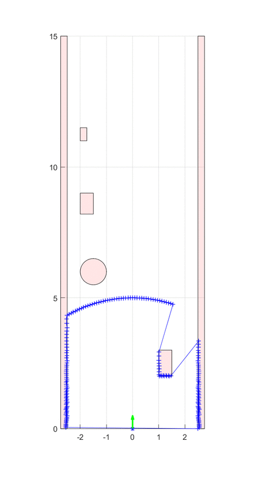

# Matlab-Proximity-Laser-Scanner-Simulation

This simulation was designed by me as part of an academic project. The simulation is calculating measurement points of a Proximity Laser Scanner (PLS) in Matlab. The PLS will calculate the reflection points of the obstacles on the virtual map on a predefined path of travel.

## Simulation Paramters
Following parameters can be changed:

| Name         | Description                              | Default         |
|--------------|------------------------------------------|-----------------|
| pls_res      | Angular resolution of PLS in °           |        1        |
| pls_dof      | Degree of freedome of PLS in °           |       180       |
| pls_n        | Number of angular measurement segements  | pls_dof/pls_res |
| pls_max_dist | Maximum measurable distance of PLS in m  |        5        |
| pls_x        | Initial x-position of PLS in m           |        0        |
| pls_y        | Initial y-position of PLS in m           |        0        |
| pls_angle    | Initial angle of PLS in °                |        0        |
| sim_grid     | Grid size of PLS data measurement in m   |       5e-2      |
| sim_grid_rte | Grid size of route path computation in m |       0.15      |
| auto_scaling | Auto scaling of plot during simulation   |      false      |
| xlim_value   | x-Limits for manual scaling in m         |   [-2.75 2.75]  |
| ylim_value   | y-Limits for manual scaling in m         |      [0 15]     |

## Simulation Environment
The simulation was designed and tested on Matlab 2018b on Windows 10 and macOS 10.14.3.

## Manual
To run the simulation following steps must be performed:
1. Open Matlab and navigate to the PLS_matlab_simulator.m
2. Run the file. Immediately a plot should appear with the simulation
3. The simulation will automatically stop at the route target or you can stop by pressing CTRL+C or CMD+C

